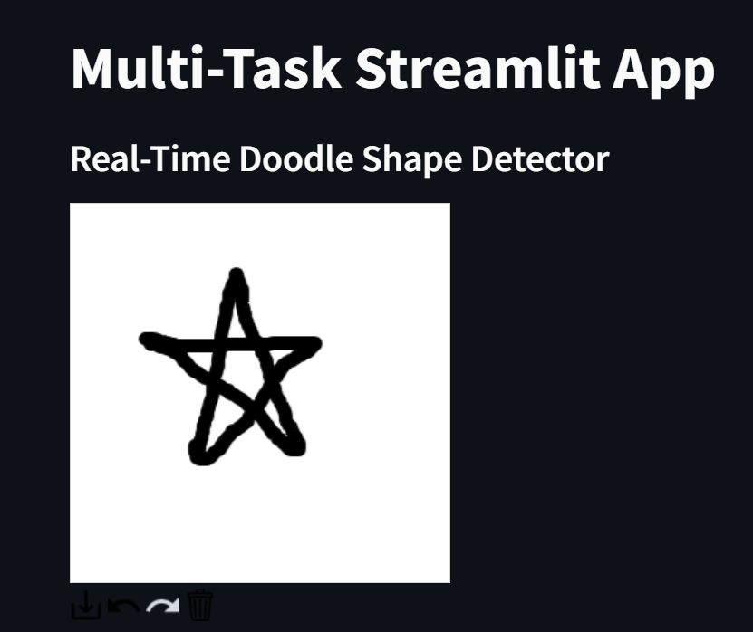

# Multi-Task Doodle and Symmetry Detection App

## Team Name: HeavyComders
### Team Members:
- Eashan Bhatia
- Aman Bhardwaj

## Project Overview

This project showcases a Streamlit application that performs two key tasks:

1. **Doodle Shape Detection**: A real-time detector that recognizes hand-drawn doodles.
2. **Mirror Symmetry Detection**: Detects and draws the mirror symmetry line for regular shapes in images.

Our custom-trained model powers the shape detection, ensuring accurate and real-time predictions. The app is designed for ease of use, allowing users to either draw their shapes directly or upload an image for symmetry analysis.

### Deployed Application

You can access the live application using the following link:

[**Multi-Task Doodle and Symmetry Detection App**](https://heavycomders-gensolve.streamlit.app/)

## Features

### Doodle Shape Detection

- **Drawing Pad**: Users can draw any shape on the canvas.
- **Shape Recognition**: The app identifies the drawn shape using a custom-trained TensorFlow model.
- **Supported Shapes**: The model detects a variety of shapes, including circles, triangles, squares, stars, and more.

### Mirror Symmetry Detection

- **Image Upload**: Users can upload any image for symmetry analysis.
- **Mirror Line Detection**: The app uses computer vision techniques to identify and draw the line of symmetry.
- **Visual Feedback**: The detected mirror line is superimposed on the image for easy interpretation.

## How It Works

### Doodle Shape Detection

1. **Drawing**: Users draw a shape on the canvas using the Streamlit drawable canvas.
2. **Bitmap Conversion**: The drawn image is resized and converted into a bitmap format suitable for prediction.
3. **Shape Prediction**: The bitmap is fed into a custom-trained TensorFlow model that predicts the shape.
4. **Result Display**: The predicted shape is displayed to the user.

### Mirror Symmetry Detection

1. **Image Upload**: Users upload an image in `jpg`, `jpeg`, or `png` format.
2. **Feature Extraction**: The app extracts key points from the image and its horizontally flipped counterpart using SIFT (Scale-Invariant Feature Transform).
3. **Match Point Analysis**: The app identifies match points between the original and flipped images.
4. **Symmetry Line Calculation**: The mirror line is calculated based on the match points, and it is drawn over the image.

## Installation and Usage

### Local Installation

To run the application locally, follow these steps:

1. **Clone the repository**:
    ```bash
    git clone https://github.com/eashanbhatia/GenSolve-HeavyComders.git
    cd yourrepository
    ```

2. **Install dependencies**:
    ```bash
    pip install -r requirements.txt
    ```

3. **Set up environment variables**:
   - Create a `.env` file in the root directory and populate it with your Google API credentials.
   - Ensure your TensorFlow model (`doodle-10-2.h5`) is placed in the root directory.

4. **Run the application**:
    ```bash
    streamlit run app.py
    ```

### Deploying Your Own Version

To deploy your own version of the application, you can follow typical deployment steps for Streamlit, such as using Streamlit Share, Heroku, or other cloud platforms.

## Model Training

The shape detection model was trained on a custom dataset of doodles, utilizing TensorFlow and Keras. The training process involved:

- **Data Preprocessing**: Converting images to grayscale and resizing them to 28x28 pixels.
- **Model Architecture**: A Convolutional Neural Network (CNN) designed to classify 10 distinct shapes.
- **Training**: The model was trained over multiple epochs with data augmentation to improve generalization.

## Visuals

### Doodle Shape Detection

-*User drawing a shape on the canvas.*



-*Detected shape displayed on the app.*


### Mirror Symmetry Detection

-*User uploads an image on the app.*


-*Mirror symmetry line detected and displayed on the uploaded image.*


## Contributing

Contributions are welcome! Please create a pull request or submit an issue for any suggestions or improvements.

